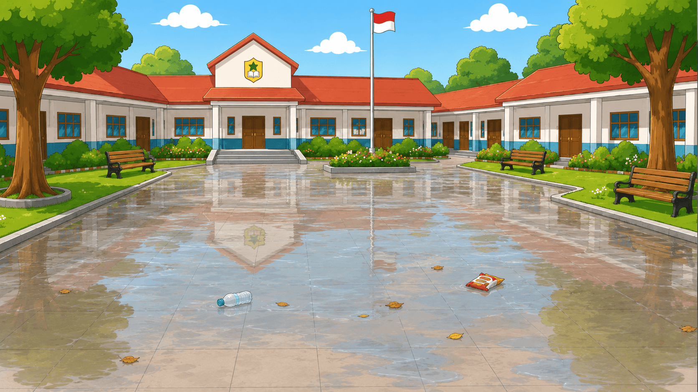
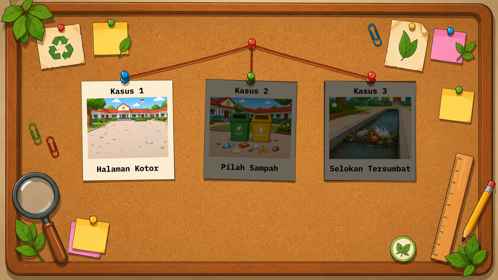
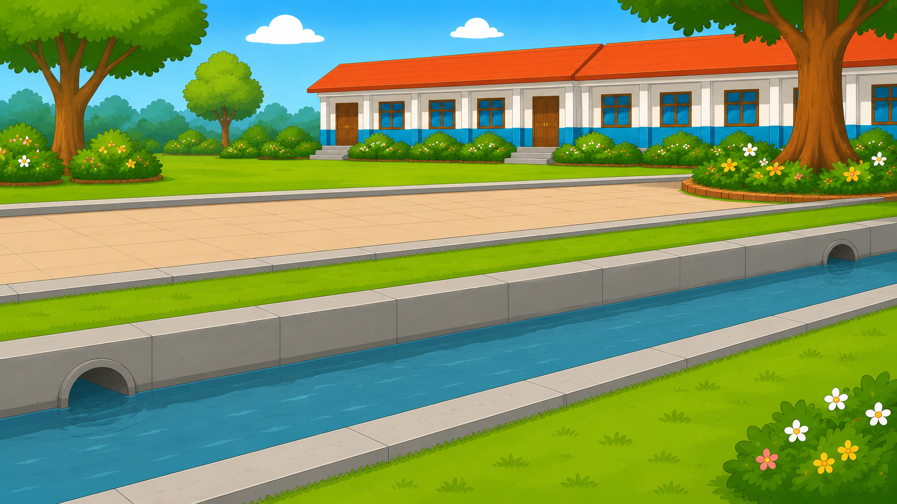
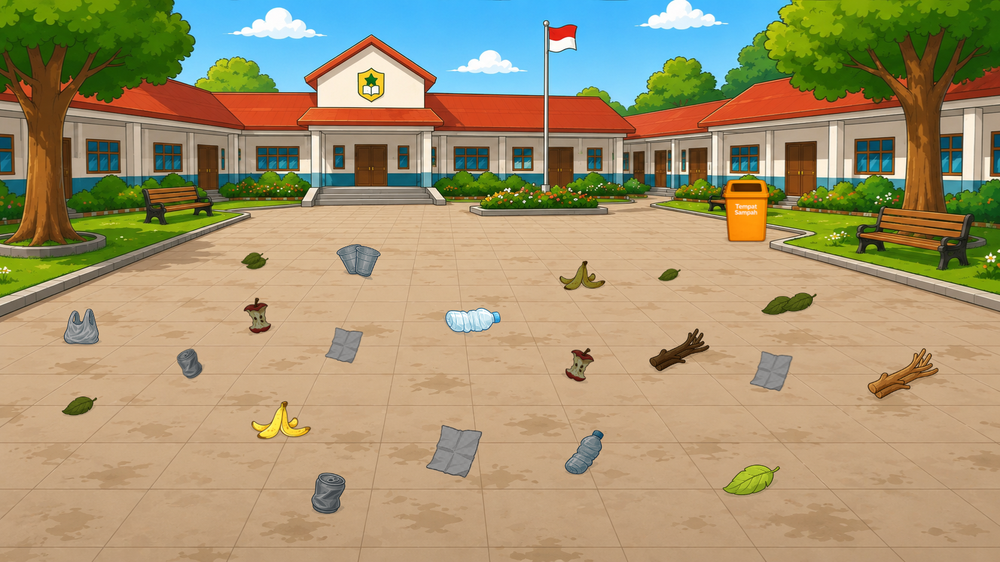

# 🌍 Detektif Sampah (Eco Detective) - KKN Game Project

<div align="center">
  
</div>

<br />

<div align="center">
  <strong>An interactive, educational web-based game designed to teach children about environmental awareness and waste management.</strong>
</div>
<br />

<div align="center">
  
  
  
  
  
</div>

---

## 📖 About the Project

**Detektif Sampah** (Eco Detective) is a specialized educational game created as part of a **KKN (Kuliah Kerja Nyata)** initiative. The game aims to build environmental awareness among students through engaging, interactive storytelling.

Players step into the shoes of a "Garbage Detective" to investigate polluted areas, solve environmental cases (like cleaning up dirty yards and clogged sewers), and learn how to properly categorize and manage waste. By combining an interactive web portal with a dedicated 2D game engine, it provides a seamless and fun learning experience.

## ✨ Key Features

- 🕵️‍♂️ **Interactive Detective Gameplay**: Built with **Phaser**, players explore scenes, interact with objects, and solve pollution cases.
- 📚 **Educational Modules**: Dedicated learning sections (`/edukasi`) that provide supplementary material about waste management.
- 🏆 **Global Leaderboard**: Integrated with **Supabase**, allowing players to compete for the highest score as the ultimate eco-detective.
- 👩‍🏫 **Teacher & Progress Dashboard**: Track student progress and view detailed statistics (`/guru` & `/progres`).
- ⚡ **Seamless React Integration**: The game runs smoothly inside a modern React application, offering full-screen modes and responsive UI.
- 🎵 **Immersive Audio & Visuals**: Features custom characters, dynamic typing dialogues, transitions, and engaging sound effects.

---

## 🖼️ Sneak Peek

<div align="center">
  
  
</div>
<br/>
<div align="center">
  
  
</div>

---

## 🛠️ Technology Stack

- **Frontend Core**: [React 19](https://react.dev/)
- **Game Engine**: [Phaser](https://phaser.io/)
- **Routing**: React Router DOM v7
- **Styling & Icons**: Vanilla CSS & [Lucide React](https://lucide.dev/)
- **Backend / Database**: [Supabase](https://supabase.com/)
- **Build Tool**: [Vite](https://vitejs.dev/)
- **Language**: TypeScript

---

## 📂 Project Structure

```text
kkn-game/
├── public/                 # Static public assets
├── src/
│   ├── assets/             # Game assets (backgrounds, audio, characters)
│   ├── components/         # Reusable React UI components (Layout, Navbar, etc.)
│   ├── game/               # Phaser Game Logic
│   │   └── scenes/         # Game Scenes (Intro, Investigation, Cleanup, Solution)
│   ├── lib/                # Libraries and API clients (Supabase client)
│   ├── pages/              # React Routes (Home, Learn, Teacher, Progress, About)
│   ├── App.tsx             # Main Application Router
│   └── main.tsx            # React Entry Point
└── package.json            # Dependencies and scripts
```

---

## 🚀 Getting Started

Follow these instructions to get a copy of the project up and running on your local machine for development and testing purposes.

### Prerequisites

Ensure you have the following installed:
- **Node.js** (v18 or higher recommended)
- **npm**, **yarn**, or **pnpm**

### Installation

1. **Clone the repository** (if applicable):
   ```bash
   git clone <your-repository-url>
   cd kkn-game
   ```

2. **Install dependencies**:
   ```bash
   npm install
   ```

3. **Set up Environment Variables**:
   Create a `.env` file in the root directory and add your Supabase credentials:
   ```env
   VITE_SUPABASE_URL=your_supabase_url
   VITE_SUPABASE_ANON_KEY=your_supabase_anon_key
   ```

4. **Run the development server**:
   ```bash
   npm run dev
   ```

5. **Open the App**:
   Navigate to `http://localhost:5173` in your browser.

---

## 📜 Available Scripts

- `npm run dev`: Starts the Vite development server.
- `npm run build`: Compiles TypeScript and builds the app for production.
- `npm run preview`: Bootstraps a local server to preview the production build.
- `npm run lint`: Runs Oxlint to analyze code quality.

---

## 🤝 Contributing

This project is part of a university KKN program. If you are part of the team and wish to contribute:

1. Create your Feature Branch (`git checkout -b feature/AmazingFeature`)
2. Commit your Changes (`git commit -m 'Add some AmazingFeature'`)
3. Push to the Branch (`git push origin feature/AmazingFeature`)
4. Open a Pull Request

---

<div align="center">
  Made with ❤️ for a cleaner and greener future! 🌱
</div>
